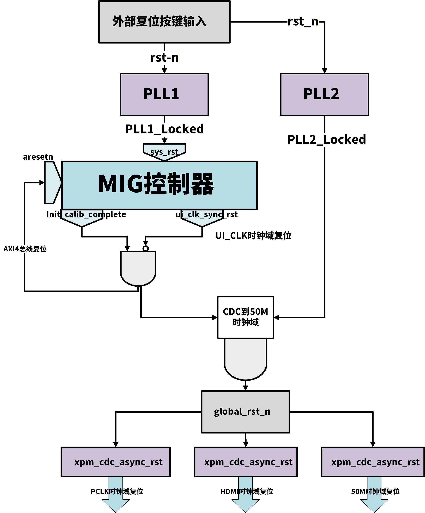
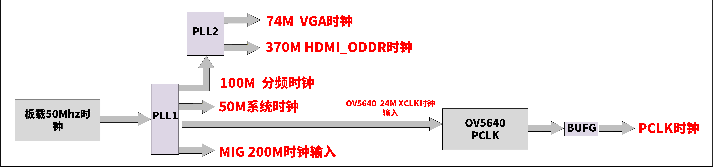

# 基于 DDR3 的双缓冲视频直通系统

## 项目简介
独立设计并实现基于 AXI4 总线的双缓冲视频管道，将 OV5640 摄像头画面写入 DDR3，再由 HDMI 稳定输出。通过乒乓操作解决单缓存读写冲突导致的画面撕裂问题，实现 1280×720@30fps 的稳定显示。系统已通过上板验证，时序收敛。

## 关键成果
-   **画面稳定无撕裂**：通过双缓冲乒乓操作，彻底解决单缓存读写冲突导致的画面撕裂。
-   **时序收敛**：编写全工程时序约束，将 WNS 从 -3.6 ns 优化至 +0.99 ns。
-   **可靠帧边界标定**：使用 AXI 突发计数精确判定帧末尾，避免跨域信号导致的数据错位。
-   **工程规范化**：全参数化设计，消除魔数；完善跨时钟域处理，解决亚稳态引起的随机闪屏。

## 技术亮点
-   **AXI4 Master/Slave 接口设计**：手写 `fifo_to_axi4` 与 `axi4_to_fifo` 转换模块，完成视频流与 AXI4 协议的桥接。
-   **乒乓缓冲控制器**：自主设计读写指针互斥逻辑，确保读写速率不匹配时缓冲区安全切换。
-   **跨时钟域处理**：使用 XPM_CDC 原语处理 `addr_clr` 等关键信号的跨域同步，消除亚稳态。
-   **时序约束与收敛**：手动约束主时钟、生成时钟与跨域路径，将关键路径时序余量由负转正。
-   **ILA 在线调试**：熟练使用 ILA 抓取波形，定位故障。

## 文件说明
-   `RTL/`：核心 RTL 代码
-   `DOC/`：双缓冲架构设计文档、时序约束分析
-   `IMAGES/`：上板稳定画面照片、双缓冲架构设计图、时钟树及复位树图
