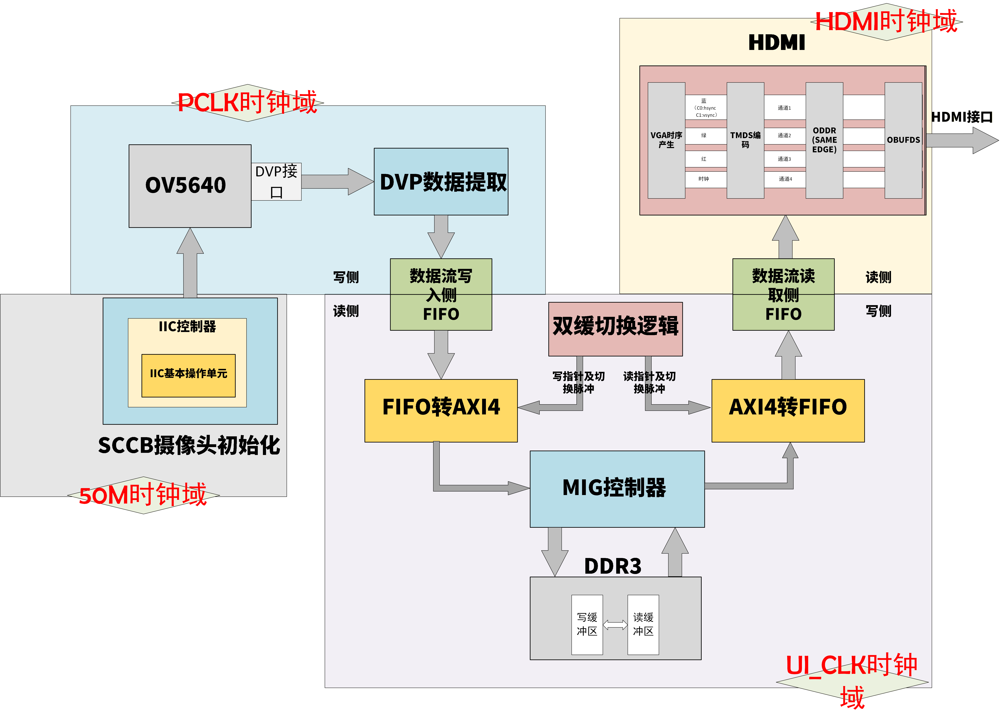
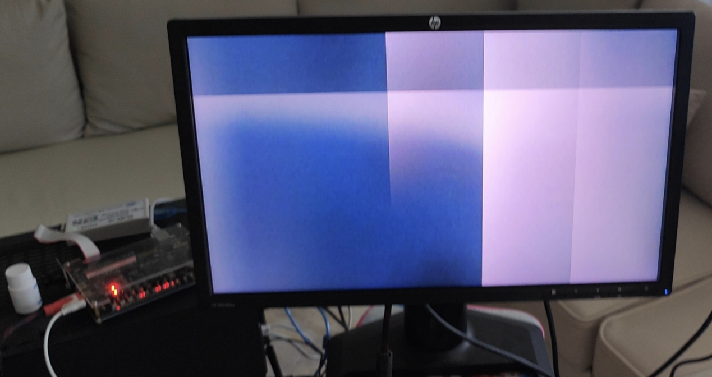
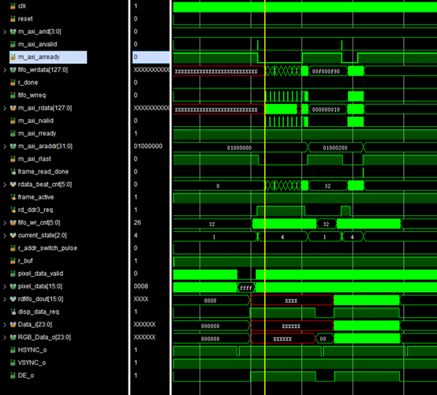
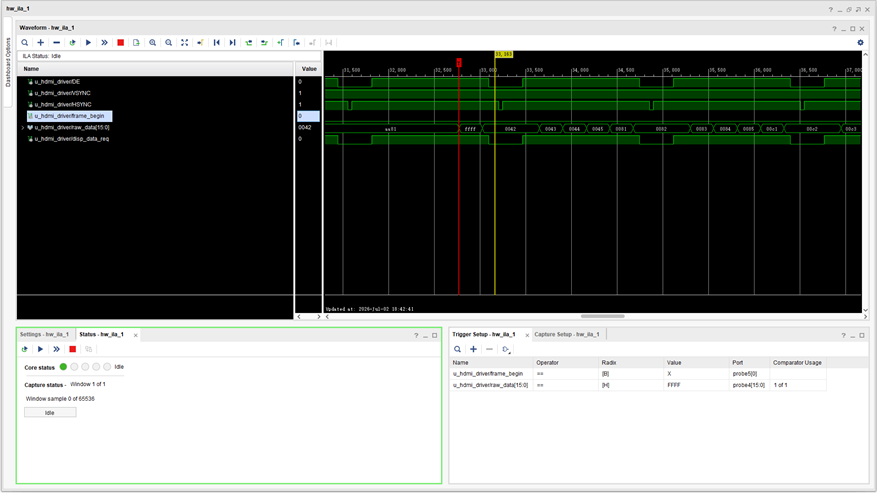
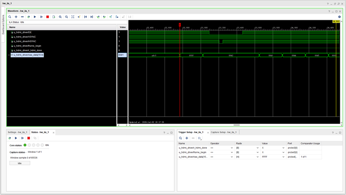
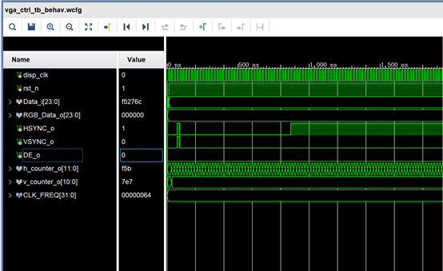
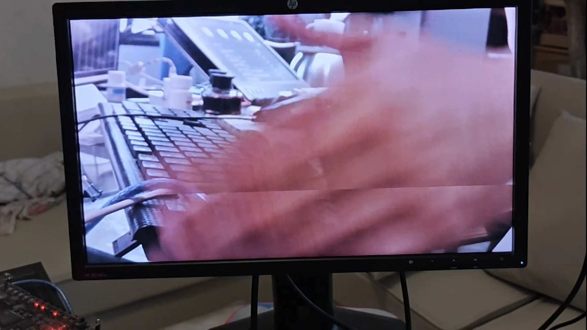

# 基于 DDR3 的双缓冲视频直通系统

## 项目简介
独立设计并实现基于 AXI4 总线的双缓冲视频管道，将 OV5640 摄像头画面写入 DDR3，再由 HDMI 稳定输出。通过乒乓操作解决单缓存读写冲突导致的画面撕裂问题，实现 1280×720@30fps 的稳定显示。系统已通过上板验证，时序收敛。

## 关键成果
-   **画面稳定无撕裂**：通过双缓冲乒乓操作，彻底解决单缓存读写冲突导致的画面撕裂。
-   **时序收敛**：编写全工程时序约束，将 WNS 从 -3.6 ns 优化至 +0.99 ns。
-   **可靠帧边界标定**：使用 AXI 突发计数精确判定帧末尾，避免跨域信号导致的数据错位。
-   **工程规范化**：全参数化设计，消除魔数；完善跨时钟域处理，解决亚稳态引起的随机闪屏。

## 技术亮点
-   **AXI4 Master/Slave 接口设计**：手写 `fifo_to_axi4` 与 `axi4_to_fifo` 转换模块，完成视频流与 AXI4 协议的桥接。
-   **乒乓缓冲控制器**：自主设计读写指针互斥逻辑，确保读写速率不匹配时缓冲区安全切换。
-   **跨时钟域处理**：使用 XPM_CDC 原语处理 `addr_clr` 等关键信号的跨域同步，消除亚稳态。
-   **时序约束与收敛**：手动约束主时钟、生成时钟与跨域路径，将关键路径时序余量由负转正。
-   **ILA 在线调试**：熟练使用 ILA 抓取波形，定位故障。

## 文件说明
-   `RTL/`：核心 RTL 代码
-   `DOC/`：双缓冲架构设计文档、时序约束分析
-   `IMAGES/`：上板稳定画面照片、双缓冲架构设计图、时钟树及复位树图

## 调试记录：双缓冲花屏问题排查

### 故障现象
使用自建帧结束信号（计数AXI突发次数）后，画面出现规律性花屏。具体表现为：屏幕横向被均分为五块，有一条扫描线自下而上周期性移动。任意时刻，屏幕上的图像可拼凑为一幅完整画面，但整体向上偏移，底部像素从上方“溢出”。

**图1 花屏实验现象**

### 问题分析
- 系统分辨率 1280×720，像素格式 RGB565。
- AXI4 突发配置：AWLEN/ARLEN = 31，AWSIZE/ARSIZE = 4，单次突发传输 512 Byte = 256 像素。
- 水平方向 1280 像素恰好对应 **5 次突发**。
- **结论**：每帧图像少了一次读突发，导致前后帧数据错位，画面不断向上滚动。

### 排查过程

**猜想1：DDR3 初始化后的“无效读”**
- **分析**：DDR3 初始化完成后，读 FIFO 空，控制器立即发起一次读突发，但此时 DDR3 中尚无有效数据，导致一次垃圾读。
- **验证**：使用 256×2 分辨率加速仿真，确实观察到首次读突发的无效数据。
- **尝试**：使用 Camera 写完成信号作为 `rd_enable`，跳过首次无效读。
- **结果**：现象依旧，无效读并非主因。
- 
**图2 第一次无效读取截图**

**猜想2：HDMI 读请求与帧边界未对齐**
- **分析**：`disp_data_req` 可能未与帧有效区域对齐，导致提前读取。
- **验证**：在顶层生成测试图像，像素值携带行列号与突发号。ILA 抓取发现复位后第一次显示即已错位。
- **尝试**：将 Camera 写完成信号同步到 HDMI 时钟域，结合场同步信号 `vsync`，共同控制 `disp_data_req` 的使能。
- **结果**：现象依旧，错位根源在上电后首次突发。

**图3 ILA波形抓取**

**猜想3：复位后第一次读突发即已错位**
- **验证**：ILA 反复抓取复位后的第一拍读突发。
- **发现**：复位释放后，首次读突发即已错位。**问题根源锁定在复位逻辑。**
  
**图4 ILA波形抓取**

### 根本原因定位
通过仿真 HDMI 驱动器的场同步时序，发现 `vsync` 信号在复位后会产生一次**毛刺脉冲**。该脉冲被用作读 FIFO 的复位信号，导致 FIFO 被意外复位，内部读指针归零，数据序列错乱。

**图5 复位错位的 VSYNC 波形**

### 解决方案与结果
- 将读 FIFO 的复位源从 `vsync` 改为 **DVP 数据抓取模块的复位完成信号**（该信号在丢弃前10帧无效数据后释放，保证 FIFO 复位时数据稳定）。
- 同时修正工程中所有复位信号，**全部同步到各 FIFO 的写时钟域**，消除跨域复位带来的亚稳态风险。

修复后上板验证，花屏彻底消失，画面稳定无闪烁。

## 上板测试果，对比单缓冲和双缓冲
**图6 有撕裂的单缓冲**

**视频 无撕裂的双缓冲**

