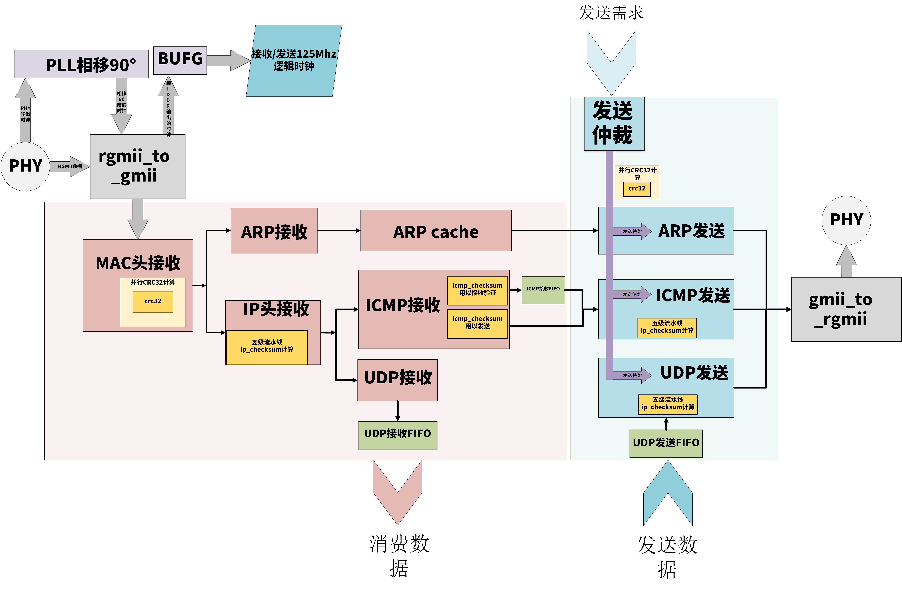
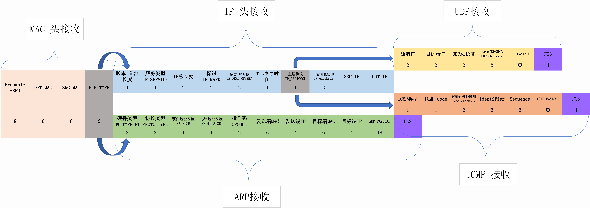
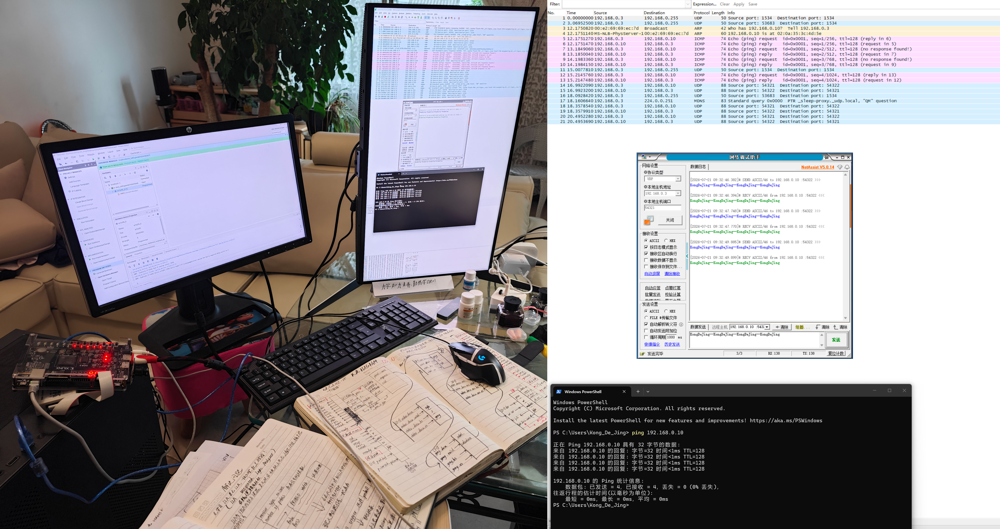

# 千兆以太网协议栈 RTL 实现

## 项目简介

从 RTL 级实现完整千兆以太网协议栈：MAC解析 → IP/UDP/ICMP/ARP 分层拆包，支持 **ICMP Ping回复、UDP回环、ARP自动应答**。通过Wireshark抓包验证，**100%无丢包**。

## 关键成果

-   **ICMP Ping 稳定回复**，延迟 0 ms
-   **UDP 回环 100% 无丢包**，支持各种长度Payload
-   **ARP 请求自动应答**，无需电脑端静态绑定MAC/IP
-   **多协议发送仲裁**：解决UDP/ICMP/ARP三路发送优先级与冲突

## 技术亮点

-   MAC/IP/UDP/ICMP/ARP 五层协议全手写RTL
-   PLL 90°相移补偿 RGMII 接收时序，确保IDDR采样窗口中心对齐
-   分层解耦架构设计，各协议模块独立，便于调试与扩展
-   FWFT FIFO 用于跨时钟域数据缓冲，解决背靠背数据污染问题
-   CRC32 并行LFSR推导与实现

## 调试记录

### 网卡无响应问题

**现象**：FPGA网口灯闪，但PC端Wireshark收不到任何包。

**排查过程**：一度怀疑协议栈帧内容错误，反复检查发送帧结构无果。最终重写顶层代码，核对ODDR原语端口时发现 **D1/D2 输入端接反**，导致发送时钟相位偏移180度，PC无法采样。

**解决方案**：修正ODDR端口连接，问题解决。

**教训**：Xilinx原语的端口位序不会在综合时报错，需要人工核对。任何硬件原语使用前，必须仔细阅读手册。

### ICMP Ping偶发超时

**现象**：Ping通但偶尔超时，ICMP Reply数据错乱。

**排查过程**：通过ILA抓取ICMP接收FIFO的读写时序，发现FWFT FIFO的读使能信号在最后一个数据时提前拉低，导致数据虽被读走但FIFO内部未标记为“已消费”。

**解决方案**：修正读使能信号的时序，确保最后一个数据也能被正常消费。

**教训**：使用IP核不能只看功能描述，必须深入理解其时序行为（尤其是FWFT模式下）。

## 文件说明

-   `RTL/`：核心RTL代码

### 顶层与回环测试
#### [gmii以太网协议栈顶层](./RTL/Ethernet.srcs/sources_1/ethernet_top.v)
#### [rgmii以太网协议栈顶层](./RTL/Ethernet.srcs/sources_1/ethernet_top_rgmii.v)
##### [UDP回环测试](./RTL/Ethernet.srcs/sources_1/ethernet_lookback_test.v)
##### [UDP回环数据转发](./RTL/Ethernet.srcs/sources_1/udp_lookback.v)

### GMII与RGMII转换
#### [gmii转rgmii](./RTL/Ethernet.srcs/sources_1/gmii_rgmii_transfer/gmii_to_rgmii.v)
#### [rgmii转gmii](./RTL/Ethernet.srcs/sources_1/gmii_rgmii_transfer/rgmii_to_gmii.v)

### 接收模块
#### [以太网协议栈接收顶层](./RTL/Ethernet.srcs/sources_1/ethernet_rx/ethernet_rx_top.v)
##### [MAC头接收](./RTL/Ethernet.srcs/sources_1/ethernet_rx/main_module/mac_rx_engine.v)
##### [ARP接收](./RTL/Ethernet.srcs/sources_1/ethernet_rx/main_module/arp_rx_engine.v)
##### [IP头接收](./RTL/Ethernet.srcs/sources_1/ethernet_rx/main_module/ip_rx_engine.v)
##### [ICMP接收](./RTL/Ethernet.srcs/sources_1/ethernet_rx/main_module/icmp_rx_engine.v)
##### [UDP接收](./RTL/Ethernet.srcs/sources_1/ethernet_rx/main_module/udp_rx_engine.v)
##### [ARP回复控制](./RTL/Ethernet.srcs/sources_1/ethernet_rx/arp_cache_requester/arp_cache.v)

### 发送模块
#### [以太网协议栈发送顶层](./RTL/Ethernet.srcs/sources_1/ethernet_tx/ethernet_tx_top.v)
#### [以太网协议栈源端发送仲裁](./RTL/Ethernet.srcs/sources_1/ethernet_tx/ethernet_tx_scheduler.v)
##### [ARP发送](./RTL/Ethernet.srcs/sources_1/ethernet_tx/main_module/arp_tx_engine.v)
##### [ICMP发送](./RTL/Ethernet.srcs/sources_1/ethernet_tx/main_module/icmp_tx_engine.v)
##### [UDP发送](./RTL/Ethernet.srcs/sources_1/ethernet_tx/main_module/udp_tx_engine.v)

### CRC计算
#### [CRC计算控制模块](./RTL/Ethernet.srcs/sources_1/gmii_rgmii_transfer/gmii_to_rgmii.v)
#### [并行CRC计算模块](./RTL/Ethernet.srcs/sources_1/gmii_rgmii_transfer/rgmii_to_gmii.v)

-   `IMAGES/`：Wireshark验证截图、ILA调试截图、以太网架构图

  
## 上板实验回环截图

