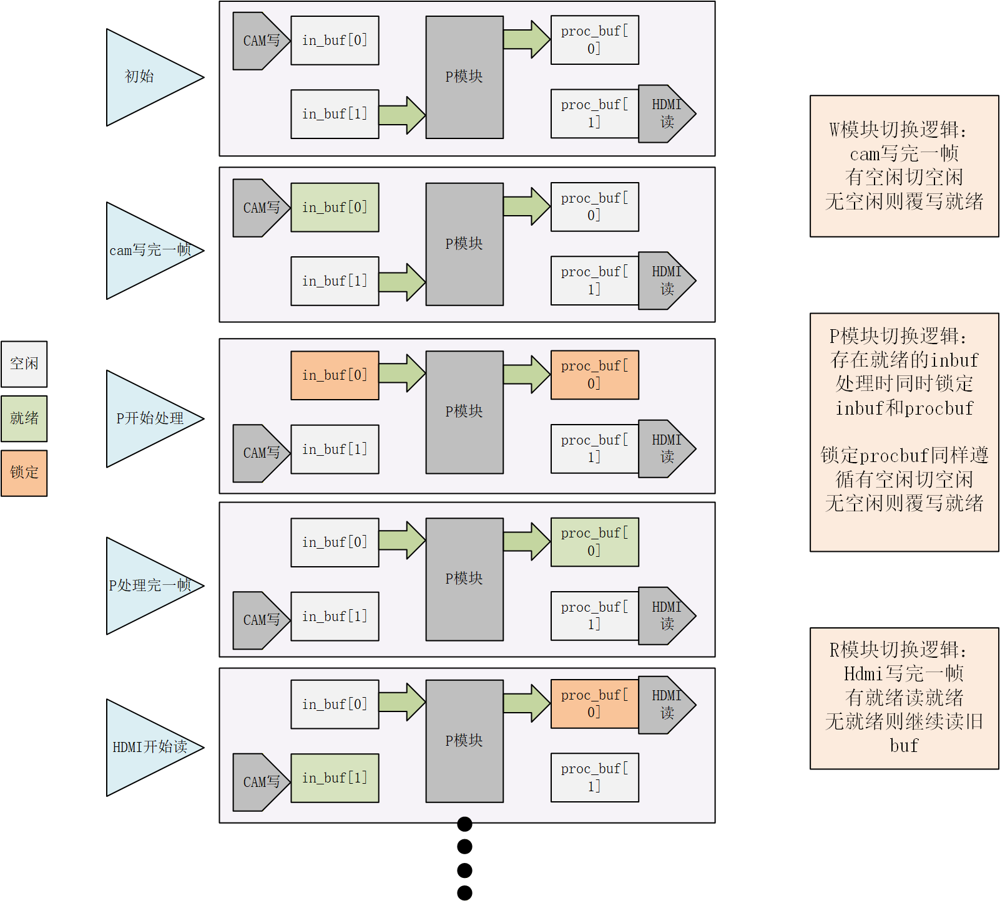
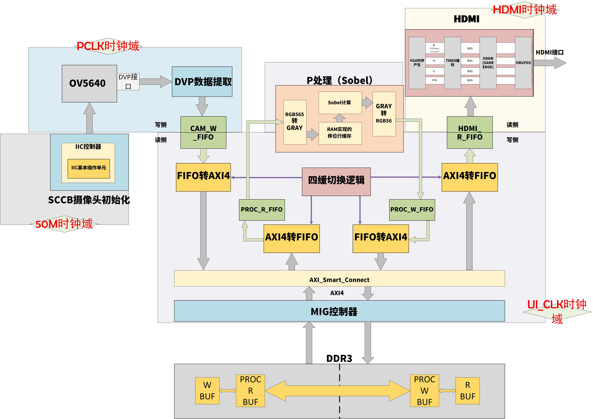
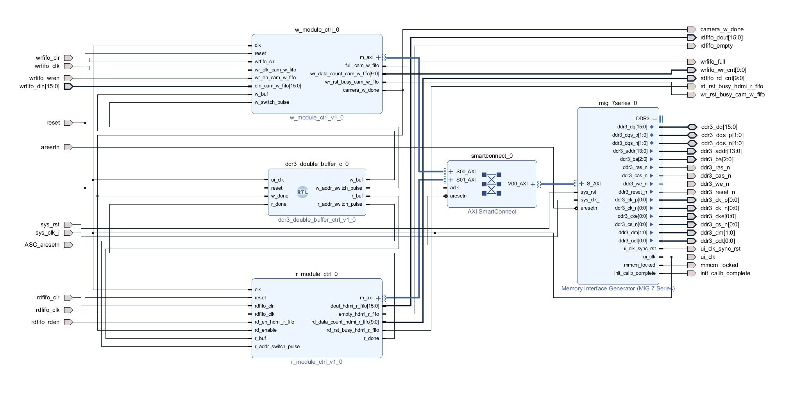
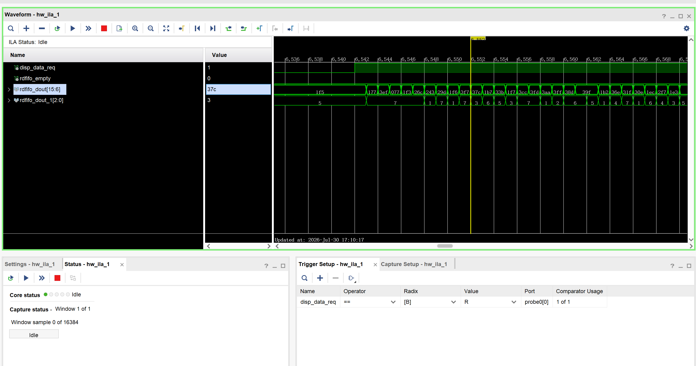
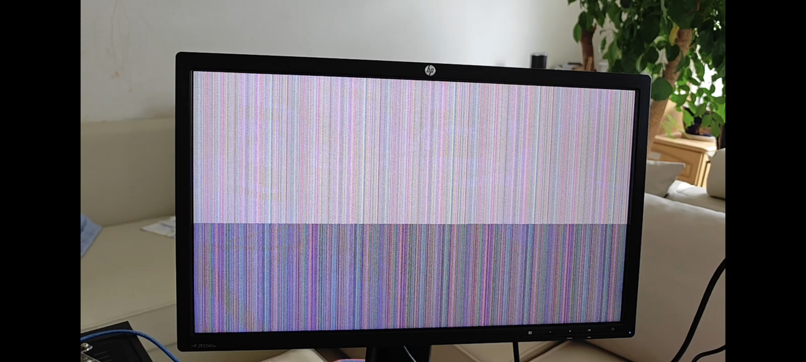
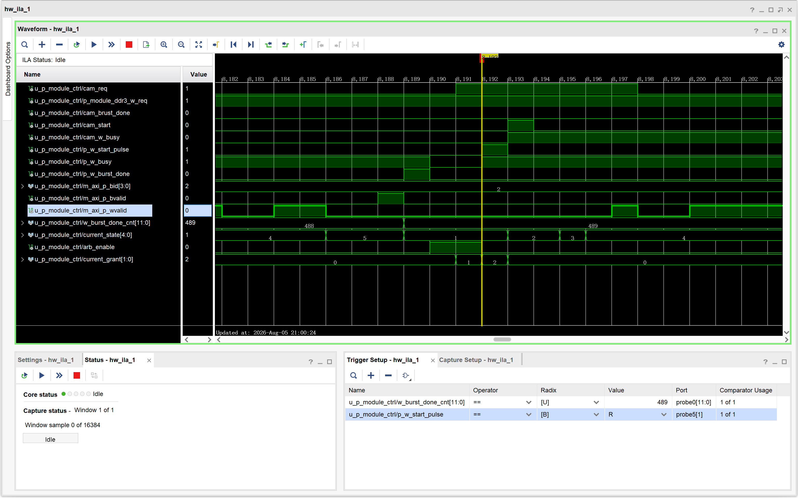
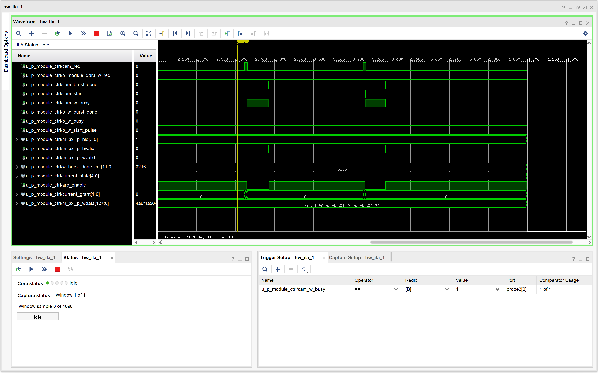
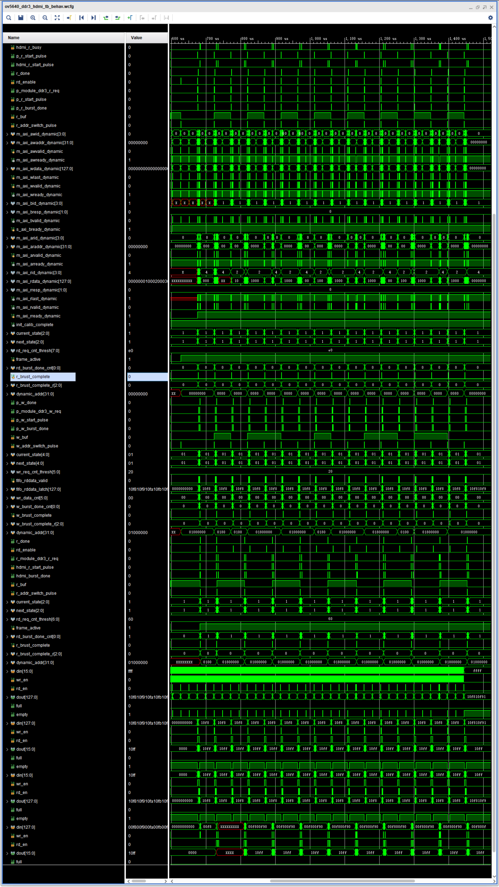

# 四缓冲视频缓存架构设计

## 项目简介

为解决实时视频处理中“非就地处理”（算法需同时读取源帧、写入结果帧）带来的缓存管理难题，独立推导并设计了**四缓冲（Quad Buffer）架构**。该架构从理论上解决了经典三缓冲在此场景下的死锁问题，实现了采集、处理、显示三条流水线的完全解耦。已完成完整RTL设计与核心状态机编写。该项目目前已完成全部RTL代码设计，目前正在上板调试当中
### **视频缓存四缓存架构图**

## 架构设计

四个物理Buffer在逻辑上分为两组，物理与逻辑完全隔离：

-   **in_buf 组（两个Buffer）**：Camera写入，P模块读取。
-   **proc_buf 组（两个Buffer）**：P模块写入，HDMI读取。

P模块是两组之间的唯一桥梁：它从 `in_buf` 读取原始帧，处理后将结果写入 `proc_buf`。

## 当前状态与文件说明

## 文件说明
-   `RTL/`：核心 RTL 代码
### 四缓视频项目顶层文件
#### [四缓视频项目顶层](./RTL/camera_ddr3_hdmi/sources_1/top/ov5640_ddr3_hdmi.v)

### 摄像头初始化及数据捕获相关文件
#### [SCCB初始化顶层控制文件](./RTL/camera_ddr3_hdmi/sources_1/camera/sccb_master/sccb_master.v)
#### [IIC 基本操作产生模块](./RTL/camera_ddr3_hdmi/sources_1/camera/sccb_master/iic_bit_shift.v)
#### [IIC协议拼接](./RTL/camera_ddr3_hdmi/sources_1/camera/sccb_master/iic_control.v)
#### [OV5640摄像头初始化ROM表](./RTL/camera_ddr3_hdmi/sources_1/camera/sccb_master/ov5640_init_table_jpeg.v)
#### [OV5640摄像头初始化ROM表](./RTL/camera_ddr3_hdmi/sources_1/camera/sccb_master/ov5640_init_table_rgb.v)
#### [摄像头频率帧率监控】](./RTL/camera_ddr3_hdmi/sources_1/camera/camera_monitor.v)
#### [DVP接口转FIFO数据输入](./RTL/camera_ddr3_hdmi/sources_1/camera/dvp_capture.v)

### HDMI输出驱动
#### [HDMI输出顶层](./RTL/camera_ddr3_hdmi/sources_1/hdmi_over_dvi_driver/hdmi_driver.v)
#### [VGA转HDMI](./RTL/camera_ddr3_hdmi/sources_1/hdmi_over_dvi_driver/hdmi_over_dvi_encode.v)
#### [TMDS编码](./RTL/camera_ddr3_hdmi/sources_1/hdmi_over_dvi_driver/tmds_encode.v)
#### [VGA接口时序产生](./RTL/camera_ddr3_hdmi/sources_1/hdmi_over_dvi_driver/vga_ctrl.v)

### 缓冲切换控制及AXI4总线仲裁
#### [四缓冲切换逻辑](./RTL/camera_ddr3_hdmi/sources_1/quad_buffer_ctrl/quad_buffer_ctrl.v)
#### [HDMI与P_r的读仲裁](/RTL/camera_ddr3_hdmi/sources_1/quad_buffer_ctrl/arbitration/axi4_r_arbitration.v)
#### [CAMERA与P_w的写仲裁](./RTL/camera_ddr3_hdmi/sources_1/quad_buffer_ctrl/arbitration/axi4_w_arbitration.v)

### 摄像头写入（W模块）
#### [W模块顶层](./RTL/camera_ddr3_hdmi/sources_1/quad_buffer_ctrl/W_module/w_module_ctrl.v)
#### [W模块的fifo转AXI模块](./RTL/camera_ddr3_hdmi/sources_1/quad_buffer_ctrl/W_module/cam_w_fifo_to_axi4.v)

### 基于Sobel算法的P模块（P模块）
#### [P模块顶层](./RTL/camera_ddr3_hdmi/sources_1/quad_buffer_ctrl/P_module/p_module_ctrl.v)
#### [P模块的AXI4转FIFO模块](./RTL/camera_ddr3_hdmi/sources_1/quad_buffer_ctrl/P_module/proc_r_axi4_to_fifo.v)
#### [模块的输入数据处理，添加HS/VS](./RTL/camera_ddr3_hdmi/sources_1/quad_buffer_ctrl/P_module/pixel_count_request_ctrl.v)
#### [RGB转灰度](./RTL/camera_ddr3_hdmi/sources_1/quad_buffer_ctrl/P_module/rgb_2_gray.v)
#### [基于RAM的三行像素移位缓存](./RTL/camera_ddr3_hdmi/sources_1/quad_buffer_ctrl/P_module/image_line_shift_cache.v)
#### [sobel计算逻辑](./RTL/camera_ddr3_hdmi/sources_1/quad_buffer_ctrl/P_module/sobel_calculate.v)
#### [灰度转RGB](./RTL/camera_ddr3_hdmi/sources_1/quad_buffer_ctrl/P_module/gray_2_rgb.v)
#### [处理完数据写入控制模块](./RTL/camera_ddr3_hdmi/sources_1/quad_buffer_ctrl/P_module/pixel_count_write_ctrl.v)
#### [P模块的fifo转AXI模块](./RTL/camera_ddr3_hdmi/sources_1/quad_buffer_ctrl/P_module/proc_w_fifo_to_axi4.v)

### HDMI读取（R模块）
#### [R模块顶层](./RTL/camera_ddr3_hdmi/sources_1/quad_buffer_ctrl/R_module/r_module_ctrl.v)
#### [R模块的AXI4转FIFO模块](./RTL/camera_ddr3_hdmi/sources_1/quad_buffer_ctrl/R_module/hdmi_r_axi4_to_fifo.v)

### 仿真文件
#### [仿真特制顶层](./RTL/camera_ddr3_hdmi/sources_1/top/ov5640_ddr3_hdmi_testbench.v)
#### [P模块仿真特制顶层](/RTL/camera_ddr3_hdmi/sources_1/new/p_module_ctrl_test.v)
#### [仿真文件](/RTL/camera_ddr3_hdmi/sim_1/ov5640_ddr3_hdmi_tb.v)
FIFO
### 约束文件
#### [00_pinout.xdc](./RTL/camera_ddr3_hdmi/constrs_1/00_pinout.xdc)
#### [01_clocks.xdc](./RTL/camera_ddr3_hdmi/constrs_1/01_clocks.xdc)
#### [02_input_output.xdc](./RTL/camera_ddr3_hdmi/constrs_1/02_input_output.xdc)
#### [03_cdc.xdc](./RTL/camera_ddr3_hdmi/constrs_1/03_cdc.xdc)
#### [04_exceptions.xdc](./RTL/camera_ddr3_hdmi/constrs_1/04_exceptions.xdc)

## Buffer 状态模型

每个Buffer在任意时刻处于三种互斥状态之一：

| 状态 | 含义 | 谁可以访问 |
|:---|:---|:---|
| **空闲** | 无有效数据，可被写入 | 生产者（Cam/P）可申请写入 |
| **就绪** | 生产者已写完，等待消费者取走 | 消费者（P/HDMI）可取走，生产者可覆盖 |
| **锁定** | 消费者正在使用，绝对不可覆盖 | 仅锁定它的消费者可释放 |

## 核心操作流程

## 速率组合分析

-   **Cam快，P慢**：Cam反复覆盖就绪 `in_buf`，P每次取最新。`proc_buf` 侧总有空闲，P不触发覆盖。
-   **P快，HDMI慢**：P快速产出结果，反复覆盖就绪 `proc_buf`，HDMI每次取最新。`in_buf` 侧总有空闲，Cam不触发覆盖。
-   **速率匹配**：退化为乒乓操作，从不覆盖。每帧都被处理、被显示。
-   **HDMI初始无帧**：HDMI输出初始画面或黑屏，由HDMI模块自身决定，不造成系统错误。

## 技术要点

-   **独立架构推导**：从“三缓冲在非就地处理下为何死锁”出发，推导出理论最小缓冲数公式，完成四缓冲设计。
-   **严谨的状态模型**：三种互斥状态覆盖所有生命周期，事件驱动状态转移，从根本上杜绝竞态条件。
-   **多主控互联**：基于AXI SmartConnect实现三个独立Master对单一DDR3的并发访问。
-   **多速率兼容**：自动适配Camera 30fps、HDMI 60fps的速率差异及P模块的可变处理速率。

## 调试与升级记录：从AXI SmartConnect到手写多主控仲裁器

### 1. 初始方案：基于AXI SmartConnect的多主控互联

为构建四缓冲架构，需解决Camera写、P模块读写、HDMI读四个Master对单一DDR3从设备（MIG）的并发访问问题。初始方案采用Xilinx官方IP——**AXI SmartConnect**，将其配置为多Slave接口、单Master接口的互联矩阵。
#### 基于AXI SmartConnect的四缓冲架构图

### 2. 空载测试与问题定位

在集成四缓冲控制器之前，先进行“空载测试”——仅接入Camera写模块和HDMI读模块（不接入P模块），验证SmartConnect的基本通路。
#### 空载测试的BD连线图

*   **测试现象**：上板后画面出现“雪花花屏”，但花屏下方有正常图像显示。这表明数据通路部分工作，但数据流的起始端发生了错位。

*   **排查过程**：
    1.  排除双缓冲切换逻辑问题（禁用切换后现象依旧）。
    2.  排除MIG控制器本身问题（此前纯RTL直连版本验证通过）。
    3.  使用ILA抓取SmartConnect前后的读地址与读数据，发现地址与数据均未越界。
    4.  仔细阅读SmartConnect官方手册（PG247），分析其内部ID路由、死锁避免机制等行为。
*   **推断结论**：SmartConnect内部FIFO与流水线引入的动态延迟，导致HDMI读Master的启动时机与有效数据到达时机不同步，读操作提前发起，读到了DDR3空白区域的随机数据，造成画面开头的雪花。

### 3. 解决方案：废弃ASC，手写仲裁器

为彻底消除黑盒行为的不确定性，决定**废弃AXI SmartConnect**，独立设计并实现了一个多主控读写仲裁器。

*   **设计原则**：
    *   **1、优先级仲裁**：摄像头写入 > P模块写入；HDMI读取 > P模块读取。保证实时数据流（摄像头、HDMI）不被内部处理阻塞。
    *   **2、根据AXI ID将MIG返回的读数据（R通道）和写响应（B通道）路由回对应的Master。
    *   **3、直通设计**：仲裁器内部不做数据缓存，不改变任何时序，仅做通路选择和响应分发。
*   **架构优势**：
**每一纳秒的延迟、每一个事务的顺序均在设计者掌控之中。所有信号均可通过ILA直接观测，不再有黑盒行为。相比SmartConnect，手写仲裁器消耗更少的LUT与FF资源。

### 4. 四缓冲数据流调试记录

手写仲裁器完成RTL设计、顶层连线及综合实现，成功生成比特流。上板后HDMI有背光，画面黑屏。以下是调试全过程的客观记录：

#### 干通了什么

- 四缓冲的完整RTL代码已全部编写完成，架构推导和状态机设计经独立仿真验证，逻辑正确。
- 手写写仲裁器与读仲裁器均已完成设计，并改进了仲裁逻辑，使用两段仲裁，消除了原方案中因FIFO水位触发条件组合不均导致的死锁风险。
##### 仲裁卡死截图（已解决）

- 数据通路的物理连接已打通——HDMI有背光，证明顶层连线、时钟复位及MIG初始化均已正常工作。
- ILA调试链路已打通，能够逐级追踪信号，并对测试数据进行了"行号+突发号"标记，为数据流溯源提供了直接依据。

#### 没干通什么

- 数据显示错乱：ILA抓取的突发数据并非写入的测试数据，表明数据流在传输链路的某个节点上被污染或覆盖。
##### 抓取到的数据污染截图（未解决）

- P模块写入端的"写完一帧"信号始终未能产生，导致：
  - 缓冲切换逻辑无法触发；
  - HDMI读模块无法获得启动信号；
  - 整个显示通路因缺少帧边界信号而保持黑屏。
- 根本原因定位：P模块的读模块未从入口buffer中读到足够的数据量来完成一帧处理，进而导致写入端缺乏有效数据来产生"写完"信号。
- 仿真与上板不一致：仿真条件下（256×2分辨率）数据流完全通畅，但上板在1280×720分辨率下出现错乱，表明大分辨率场景可能引入了尚未被察觉的边界条件或隐藏逻辑缺陷。

#### 当前推断

- 数据错乱可能发生在以下任一位置：Camera写入端的数据标记方式与后续模块解读方式不匹配；P模块读取端的数据拼接逻辑在高速连续突发下存在盲区；仲裁器在特定忙闲组合下将数据路由至错误的Master；或"行号+突发号"标记本身在写入时即未正确落盘。
- 在仅剩的调试时间内，通过常规ILA抓取和逐级比对已难以穷举所有可能性，需要更多时间搭建更精细的仿真环境或更换调试策略。

### 5. 当前状态与影响

四缓冲项目的上板调试尚未完成，问题已收敛至数据流错乱与P模块帧结束信号缺失。该问题不影响四缓冲控制器自身的逻辑正确性——架构推导、状态机设计及RTL代码编写均已独立验证。当前调试瓶颈属于物理层数据链路完整性排查，需更多时间进行系统性拆解。

#### 使用256*2大小的图像仿真通过图（0000-00ff,1000-10ff）

